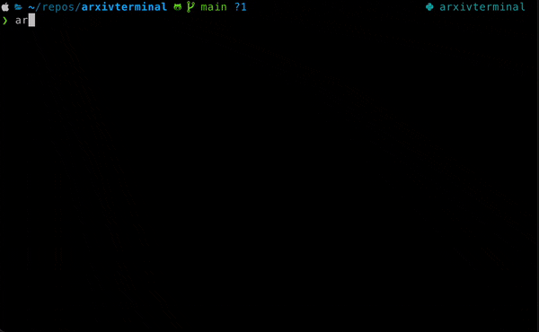

# Arxiv Terminal


Arxiv Terminal is a command-line interface (CLI) tool for fetching, searching, and displaying papers from the [arXiv](https://arxiv.org/) preprint repository. The tool allows you to fetch papers from specified categories, search the fetched papers, and display their statistics.

## Features

- Fetch paper abstracts from specified categories and save them in a local sqllite database.
- Show fetched papers and interatively open for more detailed abstracts
- Search fetched papers based on a query (Currently supports pattern + LSA semantic search)



## Contributors
A special call out to ChatGPT (v4) which helped write and modify various code and documentation in this repository.

## Installation

```bash
pip install arxivterminal
```

For local builds, you should have Poetry installed: [User Guide](https://python-poetry.org/docs/#installation). After
installation you may clone and build this repo:
```bash
poetry install
poetry shell
arxiv <command>

# Build the wheels
poetry build
```

## Usage

The CLI is invoked using the `arxiv` command, followed by one of the available commands:

- `arxiv fetch [--num-days] [--categories]`: Fetch papers from the specified categories and store them in the database.
- `arxiv delete_all`: Delete all papers from the database.
- `arxiv show [--days-ago]`: Show papers fetched from the specified number of days ago.
- `arxiv stats`: Show statistics of the papers stored in the database.
- `arxiv search <query>`: Search papers in the database based on a query.

### Examples

Fetch papers from the "cs.AI" and "cs.CL" categories from the last 7 days:

```bash
arxiv fetch --num-days 7 --categories cs.AI,cs.CL
```

Delete all papers from database:

```bash
arxiv delete_all
```

Show papers fetched in the last 7 days

```bash
arxiv show --days-ago 7
```

Display statistics of the papers stored in the database:

```bash
arxiv stats
```

Show papers containing the phrase "deep learning":

```bash
arxiv search "deep learning"
```

Show papers containing the phrase "deep learning" using LSA matching:

```bash
arxiv search -e "deep learning"
```

### LSA Search Model
> Note: This approach is likely to be replaced in the future by more robust methodology

The LSA search model is largely adapted from the implementation featured in the scikit-learn [User Guide](
https://scikit-learn.org/stable/auto_examples/text/plot_document_clustering.html#sphx-glr-auto-examples-text-plot-document-clustering-py) example.
When used, the model is trained over the entire corpus of abstracts present in the user's local database. The model
is persisted in the app cache folder and automatically reloaded on subsequent runs. During a search query, all abstracts
from the database are encoded as n-dimensional vectors using the trained LSA model. The search query is also represented
as a vector, and a cosine similarity is performed to find the top ranking items.

You may want to force a refresh of the underlying model after loading new papers. This can be done by using the `-f`
flag when performing a search:
```bash
arxiv search -e -f "deep learning"
```
